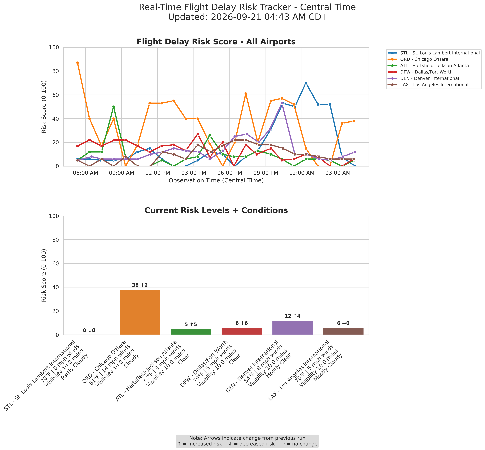

# Real-Time Flight Delay Risk ETL

A data engineering portfolio project that ingests live weather data from NOAA, calculates a predictive Flight Delay Risk Score (0-100) for six major U.S. airports, stores historical data in DuckDB, and automatically generates a dynamic multi-airport visualization dashboard with real-time conditions and trend analysis.

---

## Features

- Real-time data ingestion from NOAA National Weather Service (public JSON API, no keys required)
- Simplified Flight Delay Risk Score (demo algorithm) based on real-time weather factors: wind, visibility, precipitation, temperature, and gusts
- Lightweight DuckDB warehouse with automatic 24-hour data retention
- Professional Seaborn dashboard with rich condition details
- Automated GitHub Actions workflow (hourly updates)
- Fully self-contained zero-cost CI/CD pipeline (GitHub Actions)

---

### Flight Delay Risk Score Algorithm (0-100)

The risk score is calculated using the following weighted components:

1. **Base Score** = (Wind Speed in mph × 1.5) + (Gust Speed in mph × 0.8)
2. **Visibility Penalty**:
   - &lt; 1 mile → **+50**
   - 1 to 3 miles → **+30**
   - &gt; 3 miles → **+0**
3. **Precipitation / Severe Weather Penalty** → **+40** if the weather description contains any of: snow, thunderstorm, ice, freezing, rain, fog, or hail.
4. **Temperature Extreme Penalty** → **+15** if temperature is below **23°F** or above **95°F**.

**Final Score** = Sum of all components, then **constrained to the range 0-100**.  
Any calculated value below 0 is set to 0, and any value above 100 is set to 100.

This ensures the risk score is always a clean number between 0 (no weather risk) and 100 (extreme weather risk).

> ⚠️ **Portfolio Note on Data Intent:** This scoring algorithm is a very simplified demo proxy. It is loosely designed to showcase the ETL pipeline, data processing, and visualization features — not to provide accurate real-world aviation or weather predictions.

---

## Quick Start (Local)

cd flight-delay-risk-etl

## Create virtual environment
python3 -m venv .venv
source .venv/bin/activate

## Install dependencies
pip install -r requirements.txt

## Run pipeline
python etl.py
python visualize.py

Open latest_risk.png to see the live dashboard.

---

## GitHub Actions

This project automatically updates at **:42 past every hour** (on the GitHub Actions free tier) and on manual trigger:
- Fetches latest weather observations
- Calculates risk scores
- Regenerates the visualization
- Commits updated latest_risk.png and database

> ⚠️ Note: Execution consistency may vary due to shared runner availability and free-tier limitations.

---

## What This Demonstrates

- End-to-end ETL pipeline with real public data source
- Domain-driven feature engineering (aviation weather risk)
- Duplicate-resistant data loading with automatic 24-hour retention
- Automated CI/CD pipeline that runs hourly on GitHub Actions free tier, generates an updated visualization dashboard, and commits updated image and database to the repository. Note: Run consistency/timing can vary due to free-tier runner availability and shared resources.
- Clean, well-structured code suitable for a portfolio demonstration

---

## Technologies

* **Python 3**
* **Requests** - API data ingestion
* **Pandas + DuckDB** - Data processing and storage
* **Seaborn + Matplotlib** - Visualization
* **zoneinfo** - Timezone handling (Central Time)
* **GitHub Actions** - Automated CI/CD pipeline
* **NOAA National Weather Service API**
---

Live Dashboard: Updated hourly in this repository.

